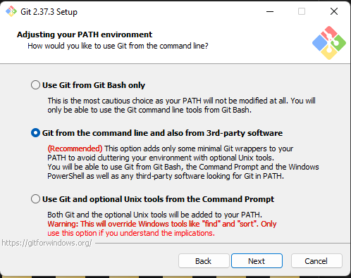
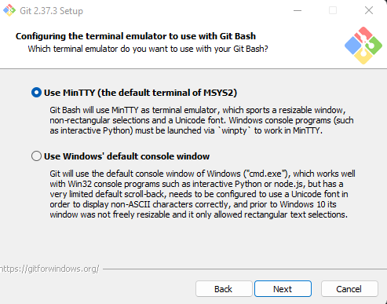
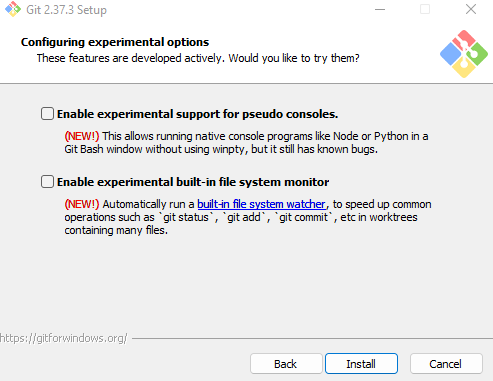

# How to Install Git For Windows.
## 1. Open the Microsoft Store and search for "VSCODE" or "Visual Studio Code" and Click Install or click this  [Link](https://apps.microsoft.com/store/detail/XP9KHM4BK9FZ7Q)

## 2. Download the GIT Installer (https://gitforwindows.org)

## 3. Double Click on The Installer you Downloaded

## 4. Follow these selected options for you Git For Windows Install

      

